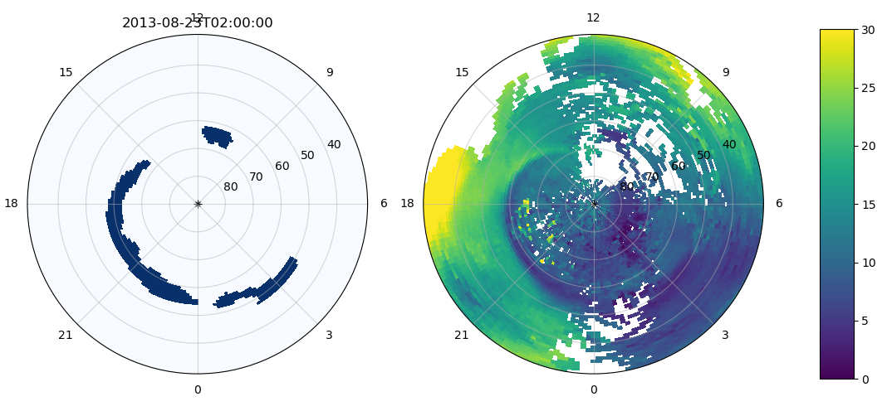

# trough

### Example

### Features
- Download Madrigal TEC, OMNI and DMSP SSUSI data
- Process datasets into more convenient `xarray` data structures and save as NetCDF
- Automatically label main ionospheric trough

# Usage

1. Clone Repo
2. create conda environment: `conda env create -f environment.yml -n trough python=3.9`
3. `conda activate trough`
4. `pip install apexpy`
5. if you get a numpy error when you try to import apexpy: `pip install --upgrade nump`
6. install trough with `pip install -e .`
7. copy `config.json.example` --> `config.json` and change any options you want
8. run with `python -m trough config.json`
9. wait for it to finish (can take several days if you are running 5+ years)
10. add `import trough` in your code and access the data using `trough.get_data`

### Config
#### Main Options
| Config Option | Definition                                                                                                              |
| --- |-------------------------------------------------------------------------------------------------------------------------|
| base_dir | base directory of trough downloads and processing, directories for downloading and processing will be created from here |
| madrigal_user_name | name supplied to MadrigalWeb                                                                                            |
| madrigal_user_email | email supplied to MadrigalWeb                                                                                           |
| madrigal_user_affil | affiliation supplied to MadrigalWeb                                                                                     |
| nasa_spdf_download_method | "http" or "ftp" (default)                                                                                               |
| lat_res | latitude resolution of processed TEC maps (degrees Apex magnetic latitude)                                              |
| lon_res | longitude resolution of processed TEC maps (degrees Apex magnetic longitude)                                            |
| time_res_unit | time resolution units (passed to `np.timedelta64`)                                                                      |
| time_res_n | time resolution in units specified above (passed to `np.timedelta64`)                                                   |
| script_name | which script to run, available scripts are in `trough/scripts.py`                                                       |
| start_date | start date of interval (YYYYMMDD, YYYYMMDD_hh, YYYYMMDD_hhmm, or YYYYMMDD_hhmmss)                                       |
| end_date | end date of interval, see "start_date" for format                                                                       |
| keep_download | whether or not to keep the downloaded files (not recommended)                                                           |
| trough_id_params | trough labeling algorithm parameters, see below                                                                         |

#### Trough Labeling Options
| Config Option | Definition                                                                          |
| --- |-------------------------------------------------------------------------------------|
| bg_est_shape | background estimation filter size in pixels [time, latitude, longitude]             | 
| model_weight_max | maximum value of L2 regularization before multiplication by coefficient `l2_weight` |
| rbf_bw | RBF bandwidth, number of pixels to half weight                                      |
| tv_hw | total variation horizontal weight                                                   |
| tv_vw | total variation vertical weight                                                     |
| l2_weight | L2 regularization coefficient                                                       |
| tv_weight | TV regularization coefficient                                                       |
| perimeter_th | minimum perimeter for a connected component in a label image                        |
| area_th | minimum area for a connected component in a label image                             |
| threshold | score threshold below which a pixel is not labeled as MIT                           |
| closing_rad | radius for disk structuring element passed to `skimage.morphology.binary_closing`   |
